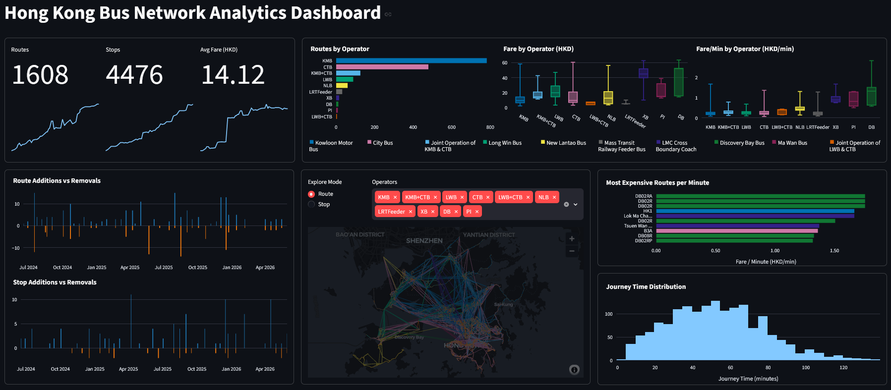

# Hong Kong Bus Network Dashboard

A Streamlit dashboard for exploring Hong Kong bus network analytics derived from processed route, stop, and edge datasets.

**Highlights**
- Interactive KPIs and trend charts (routes, stops, fares)
- Operator-level comparisons and fare/value analysis
- Map view with route and stop visualizations using PyDeck

**Demo / Screenshot**



## Features
- Time-series KPIs and small multiples for operator comparisons
- Distribution and box plots for fares and journey times
- Map visualizations showing routes and stop degrees with blended operator colors
- Tables and highlights for route changes and worst-value routes

## Requirements
- Python 3.9+
- Packages: `streamlit`, `pandas`, `pydeck`, `plotly`, `numpy`, `pyarrow`

Install dependencies with pip:

```bash
python -m pip install streamlit pandas pydeck plotly numpy pyarrow
```

## Project layout
- `Dashboard.py` — Streamlit application
- `map.py` — Map building helpers and dataset loaders
- `dataset/processed/` — Parquet data files consumed by the app

## Data
The app expects preprocessed Parquet files under `dataset/processed/`:

- `summary.parquet`
- `data.parquet`
- `route.parquet`
- `fare.parquet`
- `route_changes.parquet`
- `stop_changes.parquet`
- `stop.parquet`
- `edge.parquet`

## Usage
Run the dashboard locally with Streamlit:

```bash
streamlit run Dashboard.py
```

Open the URL printed by Streamlit (usually http://localhost:8501) and interact with the dashboard.

Key controls inside the app:
- Explore Mode: switch between `Route` and `Stop` views on the map
- Operator multiselect: filter routes by operator in `Route` mode